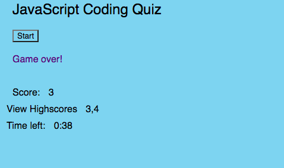

Homework for week 5 of Bootcamp

This is the homework for the fifth week of bootcamp. It teaches the use of of JavaScript through constructing a multiple-choice game that includes a timer and a record of highscores.

Installation
The website can be viewed on a internet browser.

Image

Usage
The website has no outside links or subpages. One must only click on the 'Start button to begin the game, and the answers to play.

Credits
No collaborators

License
No license